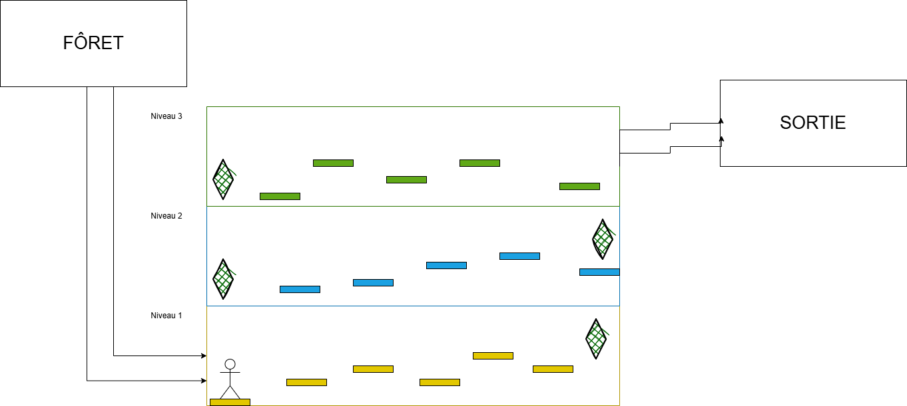

[Titre du jeu - L'ASCENSION]

Un aventurier se promène dans une forêt lorsqu'il fait une chute dans un gouffre proche d'une mine. Il se retrouve piégé au plus profond d'une grotte inexplorée.
Son seul espoir de survie : traverser ce lieu dangereux et rempli de mystères pour regagner la surface.

Notre jeux est un platformer avec un aspect de teleportation dans le genre des jeux "way up" où il a une chance que le joueur doit recommecencer depuis tout le début.

le jeux consiste a se teleporter jusqu'a la sortie de la grotte 

On va utiliser des aspects de l'environement pour guider le joueur
