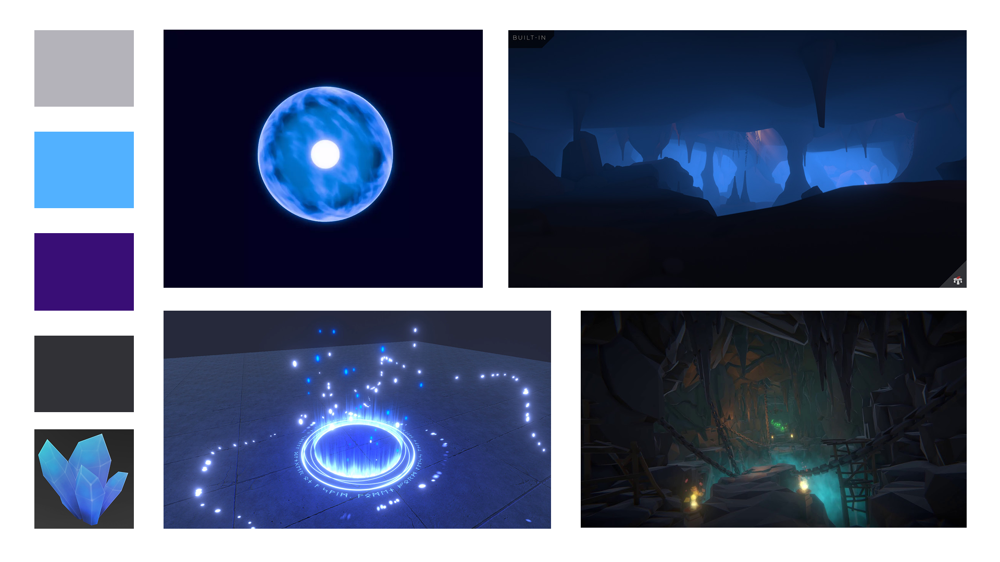

# L'ASCENSION

Un aventurier se promène dans une forêt lorsqu'il fait une chute dans un gouffre proche d'une mine. Il se retrouve piégé au plus profond d'une grotte inexplorée.
Son seul espoir de survie : traverser ce lieu rempli de mystères pour regagner la surface.

Ce jeux est un platformer comme "Only up". Le joueur peut perdre de la progression s'il tombe en bas. Il y a aussi un objet ramassable pour se téléporter contrairement à "Only up".

### MoodBoard visuel

### MoodBoard sonore
https://pixabay.com/sound-effects/film-special-effects-old-mine-ambience-200677/

https://pixabay.com/sound-effects/nature-dripping-water-in-cave-114694/

https://pixabay.com/sound-effects/film-special-effects-wind-chime-melodic-325259/

https://pixabay.com/sound-effects/film-special-effects-transition-futuristic-teleport-121420/

### Carte Environnementale

### Schéma d'Intéractivité

